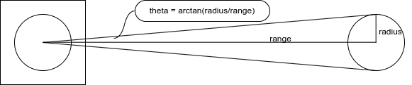

# Can Finder

This package finds cans in a lidar scan.

It does so by finding sequences of lidar reflections that are close to one another
but each end is distant from neighboring points outside the sequence. Such sequences
are possible reflections from cans, and are further qualified by validation checks.

## Scan sequence validation checks

A key validation check is whether the number of scan points in a sequence is consistent
with a can of diameter 6.6cm at whatever range the midpoint of the sequence is at. The
geometry is shown below.



The angle subtended by a can's lidar reflections is 2 * arctan(radius / range). The
LD19 lidar has 455 lidar points covering 360 degrees, so each point covers 0.79 degrees.
The algorithm approximates range by using the range to the midpoint of a sequence (which
is actually on the front of the can, so is 3.3cm less than the range to the can center).
Given a sequence with midpoint at range r, the angle subtended by the can can be
calculated as above, and the number of lidar points in an ideal scan reflection calculated.
Each sequence is checked for the number of scan points in the sequence being consistent
with a can of 3cm - 8cm diameter (some slop allows for variability in reflection off edges).

Another validation check is that the shape is convex, as verified by the end points
being further away than the midpoint.

## Rotate the scan

The first and last points in the lidar scan are directly in front of the robot. This poses
a problem because it is hard to analyze scan sequences that cross the boundary from the
last to the first element of the array of scan ranges. The algorithm works around this
by rotating the scan data in the array by 180 degrees before looking for can sequences,
then rotating it back again once sequences have been found, then publishes the sequences.
The downside of this approach is it may miss cans directly behind the robot, but that's
a lesser issue, and the benefit is simplicity and ease of verification.

## Generating the code

The ScanAnalyzer.cpp file was generated by the aider pair-programmer AI. Aider was run
with this command:

```bash
aider --model gemini --architect
```

The contents of the aider_find_cans.md file was pasted into the aider prompt enclosed in {...}
and aider generated the ScanAnalyzer.cpp file.
